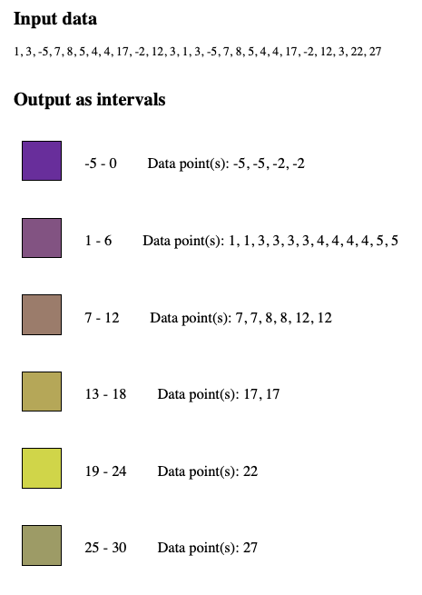
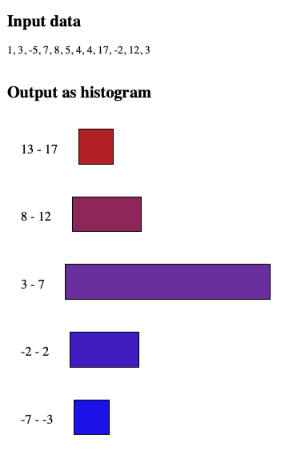

# group-into-intervals

A tool that supports statistical analysis of data by grouping data points into intervals.   
- Input an array of numbers and get it grouped for a quick and lightweight analysis.   
- Choose one of [four color schemes](#color-schemes) to go with the intervals and use the result to visualize your data. 


## Statistical background
The **number of intervals** (a.k.a. _classes_ or _bins_) is calculated with Sturges' formula `k = 1 + 3.322 * log10(number of data points)`.  
The **interval width** (or _class width_) is calculated by dividing the range of the dataset with the number of intervals. In case the interval width multiplied with the number of intervals is too small to cover the range ot the dataset, the interval width is increased by 1 until the range is covered.   

For more information about Sturges' rule and criticism of it, see [Wikipedia](https://en.wikipedia.org/wiki/Sturges%27s_rule).

## Installation
To add the module to your application, run:
```
git submodule add https://github.com/mariamair/group-into-intervals
```

To get the latest update of the module, run:
```
git submodule update --remote
```

## Usage
The module takes an array of numbers and groups them into intervals. The output is returned as JSON.

### Code examples
Requesting ascending intervals with color scheme #1: 
```js
import { groupIntoIntervalsWithColorsAscending } from '../group-into-intervals/src/index.js'

const colorSchemeId = 1
const input = [1, 3, -5, 17, 3]
const intervals = JSON.parse(groupIntoIntervalsWithColorsAscending(input, colorSchemeId))
```
Will return this object:
```js
[
  {
    lowerBoundary: -5,
    upperBoundary: 2,
    data: [ -5, 1 ],
    color: { hexValue: '#be2020', rgbValue: 'rgb(190, 32, 32)' }
  },
  {
    lowerBoundary: 3,
    upperBoundary: 10,
    data: [ 3, 3 ],
    color: { hexValue: '#7532a8', rgbValue: 'rgb(117, 50, 168)' }
  },
  {
    lowerBoundary: 11,
    upperBoundary: 18,
    data: [ 17 ],
    color: { hexValue: '#1a02f0', rgbValue: 'rgb(26, 2, 240)' }
  }
]
```

### Examples for usage of output
Use the output to easily visualize your data, e.g. displaying it as intervals or creating a histogram of your data.  

#### Example of using color scheme 3 and displaying the resulting intervals

---
#### Example of using color scheme 1 and displaying the result as histogram

---

## API

### Fetch color schemes
You can fetch all color schemes or a specific one.   
   
To get all color schemes, use:

```js
getAllColorSchemes()
```

To fetch information about a specific color scheme, call this function with one of the [color scheme ID's](#color-schemes):
```js
getColorScheme(colorSchemeId)
```
### Get intervals (without colors)
Get ascending intervals of your data:
```js
groupIntoIntervalsAscending(data)
```
Get descending intervals of your data:
```js
groupIntoIntervalsDescending(data)
```

### Get intervals (with colors)
Get the intervals together with a color for each interval. Specify the ID of the color scheme you want to use. Based on that scheme, the function will add as much colors as needed to give each interval its own color.   
_Please note: If your data results in more than 9 intervals, the created colors might be hard to distinguish visually._

Get ascending intervals with colors:
```js
groupIntoIntervalsWithColorsAscending(data, colorSchemeId)
```

Get descending intervals with colors:
```js
groupIntoIntervalsWithColorsDescending(data, colorSchemeId)
```
### Get interval metadata
Returns the metadata that will be used when your data is grouped into intervals, e.g. range, number of intervals and interval width.   

- Set `isAscending = true` if the data should be sorted ascending
- Set `isAscending = false` if the data should be sorted descending
```js
getIntervalMetadata(data, isAscending)
```
---
   
## Color schemes
| ID | Name | Color 1 | Color 2 | Color 3 |
|----|------|---------|---------|---------|
| 1 | red, violet, blue | <br>(190, 32, 32) | <br>(117, 50, 168) | <br>(26, 2, 240) | 
| 2 | red, yellow, blue | <br>(190, 32, 32) | <br>(214, 219, 66) | <br>(26, 2, 240) | 
| 3 | violet, yellow, blue | <br>(117, 50, 168) | <br>(214, 219, 66) | <br>(26, 2, 240) | 
| 4 | white, light green, dark green | <br>(255, 255, 255) | <br>(94, 193, 56) | <br>(58, 109, 37) | 


## Technical information
The module was developed with and tested for Node version 24.1.0.

## Test report summary
For a summary of the latest unit test run, see [the summary of test results](https://github.com/mariamair/test-group-into-intervals/blob/main/reports/summary.md).

For more information about the tests, see [the test report](./docs/testreport.md).

## Versions and releases
Version 1.0.0, released 2025-09-30.

## Bugs and issues
If you find any vulnerabilities, bugs or issues, please add them as an issue.

## License
[MIT License](LICENSE)

## Contributing
Interested in contributing to this module? Please see [the contribution guidelines](CONTRIBUTING.md).